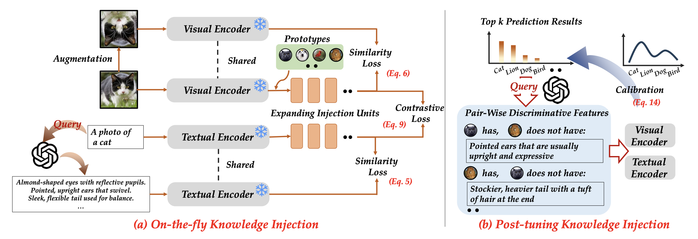

# External Knowledge Injection for CLIP-Based Class-Incremental Learning


<div align="center">
    <div>
        <a href='http://www.lamda.nju.edu.cn/zhoudw' target='_blank'>Da-Wei Zhou</a>&emsp;
        <a href='http://www.lamda.nju.edu.cn/likw' target='_blank'>Kai-Wen Li</a>&emsp;
        <a href='https://jingyinju.github.io/' target='_blank'>Jingyi Ning</a>&emsp;
        <a href='http://www.lamda.nju.edu.cn/yehj' target='_blank'>Han-Jia Ye</a>&emsp;
        <a href='https://ai.nju.edu.cn/zlj/' target='_blank'>Lijun Zhang</a>&emsp;
        <a href='http://www.lamda.nju.edu.cn/zhandc' target='_blank'>De-Chuan Zhan</a>&emsp;
    </div>
    <div>
    State Key Laboratory for Novel Software Technology, Nanjing University
    </div>
</div>

<div align="center">

  <a href="https://arxiv.org/abs/2503.08510">
    
  </a>

</div>

The code repository for "[External Knowledge Injection for CLIP-Based Class-Incremental Learning](https://arxiv.org/abs/2503.08510)"  in PyTorch.  If you use any content of this repo for your work, please cite the following bib entry: 

```bibtex
@article{zhou2025external,
  title={External Knowledge Injection for CLIP-Based Class-Incremental Learning},
  author={Da-Wei Zhou and Kai-Wen Li and Jingyi Ning and Han-Jia Ye and Lijun Zhang and De-Chuan Zhan},
  journal={arXiv preprint arXiv:2503.08510},
  year={2025}
}
```


# 📢 **Updates**

[03/2025] Code has been released.

[03/2025] [arXiv](https://arxiv.org/abs/2503.08510) paper has been released.


# 📝 Introduction
Class-Incremental Learning (CIL) enables learning systems to continuously adapt to evolving data streams. With the advancement of pre-training, leveraging pre-trained vision-language models (eg., CLIP) offers a promising starting point for CIL. However, CLIP makes decisions by matching visual embeddings to class names, overlooking the rich contextual information conveyed through language. For instance, the concept of “cat” can be decomposed into features like tail, fur, and face for recognition. Besides, since the model is continually updated, these detailed features are overwritten in CIL, requiring external knowledge
for compensation. In this paper, we introduce ExterNal knowledGe INjEction (ENGINE) for CLIP-based CIL. To enhance knowledge transfer from outside the dataset, we propose a dual-branch injection tuning framework that encodes informative knowledge from both visual and textual modalities. The visual branch is enhanced with data augmentation to enrich the visual features, while the textual branch leverages GPT-4 to rewrite discriminative descriptors. In addition to this on-the-fly knowledge injection, we also implement post-tuning knowledge by re-ranking the prediction results during inference. With the injected knowledge, the model can better capture informative features for downstream tasks as data evolves. Extensive experiments demonstrate the state-of-the-art performance of ENGINE.

<div align="center">

</div>

## 🔧 Requirements

**Environment**

1 [torch 1.11.0](https://github.com/pytorch/pytorch)

2 [torchvision 0.12.0](https://github.com/pytorch/vision)

3 [open-clip 2.17.1](https://github.com/mlfoundations/open_clip/releases/tag/v2.17.1)

**Dataset**

We provide the processed datasets as follows:

- **CIFAR100**: will be automatically downloaded by the code.
- **CUB200**: Google Drive: [link](https://drive.google.com/file/d/1XbUpnWpJPnItt5zQ6sHJnsjPncnNLvWb/view?usp=sharing) or OneDrive [link](https://entuedu-my.sharepoint.com/:u:/g/personal/n2207876b_e_ntu_edu_sg/EVV4pT9VJ9pBrVs2x0lcwd0BlVQCtSrdbLVfhuajMry-lA?e=L6Wjsc)
- **ImageNet-R**: Google Drive: [link](https://drive.google.com/file/d/1SG4TbiL8_DooekztyCVK8mPmfhMo8fkR/view?usp=sharing) or Onedrive: [link](https://entuedu-my.sharepoint.com/:u:/g/personal/n2207876b_e_ntu_edu_sg/EU4jyLL29CtBsZkB6y-JSbgBzWF5YHhBAUz1Qw8qM2954A?e=hlWpNW)
- **ObjectNet**: Onedrive: [link](https://entuedu-my.sharepoint.com/:u:/g/personal/n2207876b_e_ntu_edu_sg/EZFv9uaaO1hBj7Y40KoCvYkBnuUZHnHnjMda6obiDpiIWw?e=4n8Kpy) You can also refer to the [filelist](https://drive.google.com/file/d/147Mta-HcENF6IhZ8dvPnZ93Romcie7T6/view?usp=sharing) and processing [code](https://github.com/zhoudw-zdw/RevisitingCIL/issues/2#issuecomment-2280462493) if the file is too large to download.
- **Cars**: Google Drive: [link](https://drive.google.com/file/d/1D8ReAuOPenWi6SMNUrOZhbm6ViyhDHbL/view?usp=sharing  ) or OneDrive: [link](https://njuedu-my.sharepoint.cn/:u:/g/personal/ky2409911_365_nju_edu_cn/EbT1XAstg51Mpy82uHM0D2EBJLrtzmr_V64jeBRjqyyTnQ?e=h6g1rM)
- **UCF**: Google Drive: [link](https://drive.google.com/file/d/1Ng4w310_VDqpKbc7eYaumXTOiDxI02Wc/view?usp=sharing) or OneDrive: [link](https://njuedu-my.sharepoint.cn/:u:/g/personal/ky2409911_365_nju_edu_cn/EU2qHQXjASdLh1jIl6ihZmcB6G2KvqmSw-sTlZKDE6xPbg?e=7ezvTr)
- **Aircraft**: Google Drive: [link](https://drive.google.com/file/d/1xI5r1fU0d6Nff51HuOo5w-e4sGEP46Z2/view?usp=drive_link) or OneDrive: [link](https://njuedu-my.sharepoint.cn/:u:/g/personal/ky2409911_365_nju_edu_cn/ETVliZnmPY9AvZZgcFFJ6jMB2c7TRvcq7-gso2Aqvdl_VQ?e=pWXqdP)
- **Food**: Google Drive: [link](https://drive.google.com/file/d/1rupzXpwrbxki4l-RVmsRawhz1Cm0lDY5/view?usp=drive_link) or OneDrive: [link](https://njuedu-my.sharepoint.cn/:u:/g/personal/ky2409911_365_nju_edu_cn/Eb4xfptD4L5Egus-SiYxrIcBDH1VewLGp4kzyACGF_Na_w?e=duA3Ia)
- **SUN**: OneDrive: [link](https://njuedu-my.sharepoint.cn/:u:/g/personal/ky2409911_365_nju_edu_cn/EcQq1-1pFulKstYtdknB4O8BGo0hnlDRarAwB4wFEgkx0Q?e=YZ0xYV)

These subsets are sampled from the original datasets. Please note that I do not have the right to distribute these datasets. If the distribution violates the license, I shall provide the filenames instead.

You need to modify the path of the datasets in `./utils/data.py` according to your own path. 

## 💡 Running scripts

To prepare your JSON files, refer to the settings in the `exps` folder and run the following command. All main experiments from the paper are already provided in the `exps` folder, you can simply execute them to reproduce the results found in the `logs` folder.

```
python main.py --config ./exps/engine/[configname].json
```

## 🎈 Acknowledgement

This repo is based on [CIL_Survey](https://github.com/zhoudw-zdw/CIL_Survey) and [PyCIL](https://github.com/G-U-N/PyCIL). 

## 💭 Correspondence

If you have any questions, please  contact me via [email](mailto:zhoudw@lamda.nju.edu.cn) or open an [issue](https://github.com/RenaissCode/ENGINE/issues/new).


